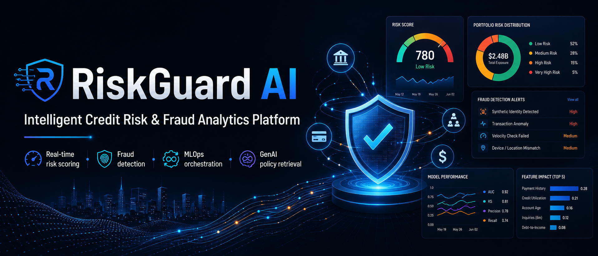
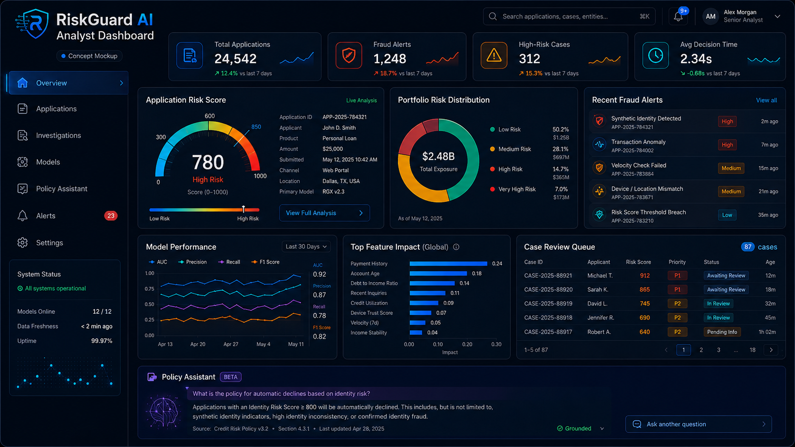
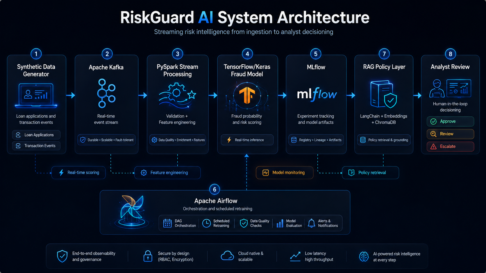

  

  <strong>Concept visualization:</strong> dashboard values shown in project artwork are illustrative and are not published benchmark results.

🛡️ RiskGuard AI

Intelligent Credit Risk & Fraud Analytics Platform

Real-time risk scoring · Fraud detection · MLOps orchestration · GenAI policy retrieval

 

An end-to-end reference platform for streaming loan applications, engineering risk features, scoring fraud and credit risk, tracking model experiments, orchestrating retraining, and retrieving policy guidance through RAG.

Architecture •Features •Results •Quick Start •Roadmap

📌 Project Status

RiskGuard AI is under active development.

The current implementation demonstrates a working backend pipeline built with Kafka, PySpark, TensorFlow/Keras, MLflow, Airflow, LangChain, Hugging Face embeddings, and ChromaDB.

Model note: The current fraud classifier uses a TensorFlow/Keras multilayer perceptron (MLP). Transformer-based risk models are planned as a future extension and are not presented as part of the current implementation.

📖 Executive Summary

Financial institutions must evaluate creditworthiness, detect fraud, explain model decisions, and respond to emerging risks—often across disconnected systems.

RiskGuard AI brings these workflows into one integrated architecture:

Streams synthetic loan applications through Kafka

Processes and engineers features with PySpark

Scores applications with a deep-learning fraud model

Tracks experiments and artifacts with MLflow

Automates retraining through Apache Airflow

Retrieves policy guidance through a RAG knowledge layer

Creates a foundation for analyst review, explainability, monitoring, and responsible-AI controls

💼 Business Use Cases

Use case

Business outcome

Credit-risk scoring

Prioritize applications by predicted default and repayment risk

Fraud detection

Flag suspicious applications before funds are disbursed

Real-time screening

Evaluate streaming applications as they enter the platform

Analyst investigation

Surface risk signals and supporting context for human review

Compliance support

Retrieve relevant lending and fraud-policy guidance through RAG

Model governance

Track experiments, model versions, artifacts, and retraining workflows

✨ Core Capabilities

Layer

Capability

Technology

Data generation

Synthetic loan and applicant event creation

Python

Event streaming

Real-time application ingestion

Apache Kafka

Feature processing

Streaming transformations and risk features

PySpark

Predictive modeling

Fraud-risk classification

TensorFlow/Keras

Experiment tracking

Metrics, parameters, and model artifacts

MLflow

Orchestration

Scheduled pipeline execution and retraining

Apache Airflow

Policy intelligence

Semantic retrieval over risk documents

LangChain + ChromaDB

Deployment foundation

Reproducible runtime packaging

Docker

🖥️ Product Experience Concept

  

  <strong>Concept mockup:</strong> this visualization represents the planned analyst experience. Displayed names, cases, dates, balances, and performance values are synthetic and illustrative.

The intended analyst workspace brings together:

Application-level risk scoring and reason codes

Fraud alerts and prioritized investigation queues

Portfolio risk distribution and operational KPIs

Model performance, feature impact, and model-health monitoring

Human-in-the-loop review states and escalation actions

Grounded policy retrieval for explainable decision support

🏗️ System Architecture

  

  Target architecture concept showing streaming ingestion, feature processing, modeling, experiment tracking, orchestration, policy retrieval, and analyst review.

flowchart LR
    A[Loan Application Generator] -->|JSON events| B[(Kafka Topic)]
    B --> C[PySpark Structured Streaming]
    C --> D[Feature Engineering]
    D --> E[TensorFlow Fraud Model]
    E --> F{Risk Decision}

    F -->|Low risk| G[Approve / Continue Review]
    F -->|Medium risk| H[Manual Analyst Review]
    F -->|High risk| I[Escalate / Block]

    E --> J[(MLflow Tracking)]
    K[Airflow Scheduler] --> A
    K --> C
    K --> E

    L[Policy Documents] --> M[Hugging Face Embeddings]
    M --> N[(ChromaDB)]
    N --> O[RAG Policy Retriever]
    O --> H

🔄 End-to-End Data Flow

sequenceDiagram
    participant G as Data Generator
    participant K as Kafka
    participant S as Spark Processor
    participant M as Fraud Model
    participant L as MLflow
    participant A as Analyst

    G->>K: Publish loan application event
    K->>S: Stream event payload
    S->>S: Validate and engineer features
    S->>M: Send model-ready feature vector
    M->>M: Generate fraud probability
    M->>L: Log metrics and model artifacts
    M-->>A: Return risk score and decision
    A->>A: Approve, review, or escalate

🧠 Fraud Decision Workflow

flowchart TD
    A[Incoming Application] --> B[Schema Validation]
    B --> C[Feature Engineering]
    C --> D[Fraud Probability]
    D --> E{Score Threshold}

    E -->|Below low-risk threshold| F[Continue Standard Processing]
    E -->|Between thresholds| G[Route to Manual Review]
    E -->|Above high-risk threshold| H[Escalate or Block]

    G --> I[Review Risk Signals]
    I --> J{Analyst Decision}
    J -->|Approve| F
    J -->|Request evidence| K[Enhanced Verification]
    J -->|Decline| H

🧪 MLOps Lifecycle

flowchart LR
    A[Generate / Ingest Data] --> B[Validate Data]
    B --> C[Train Model]
    C --> D[Evaluate Metrics]
    D --> E{Meets Thresholds?}

    E -->|No| F[Tune Features / Hyperparameters]
    F --> C

    E -->|Yes| G[Register Experiment in MLflow]
    G --> H[Deploy Candidate Model]
    H --> I[Monitor Performance]
    I --> J{Drift or Performance Drop?}

    J -->|No| I
    J -->|Yes| K[Trigger Airflow Retraining]
    K --> A

🤖 RAG Compliance Assistant Flow

flowchart LR
    A[Risk Policy Documents] --> B[Document Chunking]
    B --> C[Hugging Face Embeddings]
    C --> D[(ChromaDB Vector Store)]

    E[Analyst Question] --> F[Semantic Query]
    F --> D
    D --> G[Retrieve Relevant Policy Passages]
    G --> H[Grounded Response]
    H --> I[Analyst Review]

📊 Model Evaluation & Results

Important: numeric values shown in the concept artwork are sample UI content. Only reproducible experiment outputs should be reported as model results.

The repository is designed to log experiments through MLflow. Publish only metrics generated from your own reproducible runs.

Evaluation Scorecard

Metric

Latest validated result

Why it matters

ROC-AUC

TBD

Measures overall ranking performance

PR-AUC

TBD

More informative for imbalanced fraud datasets

Precision

TBD

Limits unnecessary investigations

Recall

TBD

Measures detected fraud coverage

F1 score

TBD

Balances precision and recall

False-positive rate

TBD

Tracks customer and analyst friction

Inference latency

TBD ms

Measures real-time readiness

Replace TBD values with outputs from a completed MLflow experiment. Do not publish unverified performance claims.

Confusion Matrix Template

Predicted legitimate

Predicted fraud

Actual legitimate

True negatives

False positives

Actual fraud

False negatives

True positives

Recommended Experiment Comparison

Model

ROC-AUC

PR-AUC

Precision

Recall

F1

Status

Logistic Regression

TBD

TBD

TBD

TBD

TBD

Planned baseline

Random Forest

TBD

TBD

TBD

TBD

TBD

Planned baseline

TensorFlow MLP

TBD

TBD

TBD

TBD

TBD

Current model

Transformer model

TBD

TBD

TBD

TBD

TBD

Roadmap

🧾 Illustrative Scoring Output

The following example shows the intended output structure. It is illustrative, not a published benchmark result.

{
  "application_id": "APP-10482",
  "fraud_probability": 0.87,
  "risk_tier": "HIGH",
  "recommended_action": "MANUAL_REVIEW",
  "risk_signals": [
    "High loan-to-income ratio",
    "Low credit score",
    "Multiple recent applications"
  ],
  "model_version": "fraud-mlp-v1"
}

📂 Repository Structure

RiskGuard-AI/
├── assets/
│   ├── riskguard-hero-banner.png
│   ├── riskguard-system-architecture.png
│   ├── riskguard-dashboard-concept.png
│   └── riskguard-portfolio-homepage.png
├── dags/
│   └── fraud_pipeline_dag.py       # Airflow retraining workflow
├── src/
│   ├── data_generation/
│   │   └── generator.py            # Synthetic loan data generation
│   ├── streaming/
│   │   └── producer.py             # Kafka event producer
│   ├── processing/
│   │   └── stream_processor.py     # PySpark streaming processor
│   ├── modeling/
│   │   └── train_model.py          # TensorFlow training and MLflow logging
│   └── rag/
│       └── retriever.py            # Policy retrieval with vector search
├── main.py                         # Main project entry point
├── run_producer.py                 # Start event producer
├── run_processor.py                # Start streaming processor
├── run_training.py                 # Train the fraud model
├── run_rag.py                      # Query the policy retriever
├── requirements.txt
├── Dockerfile
├── project_blueprint.md
├── LICENSE
└── README.md

🚀 Quick Start

1. Prerequisites

Install:

Python 3.11+

Java 11+

Apache Kafka

Apache Airflow

MLflow

Git

On macOS, Homebrew can be used to install Kafka and supporting services.

2. Clone the Repository

git clone https://github.com/Tanishq0630/RiskGuard-AI.git
cd RiskGuard-AI

3. Create a Virtual Environment

python3 -m venv venv
source venv/bin/activate

python -m pip install --upgrade pip
pip install -r requirements.txt

4. Start Kafka

brew services start zookeeper
brew services start kafka

Newer Kafka installations may use KRaft instead of ZooKeeper. Follow the setup supported by your local Kafka distribution.

5. Start MLflow

mlflow ui --port 5000

Open:

http://localhost:5000

6. Start Airflow

export AIRFLOW_HOME=$(pwd)
export AIRFLOW__WEBSERVER__WEB_SERVER_PORT=8085

airflow db migrate
airflow standalone

Open:

http://localhost:8085

Use the administrator credentials generated by Airflow during local startup. Never commit those credentials to GitHub.

7. Run the Pipeline

Use separate terminal windows as required:

python run_producer.py

python run_processor.py

python run_training.py

8. Query the RAG Retriever

python run_rag.py

Or, where supported:

python src/rag/retriever.py \
  --query "What are the risk parameters for Tier 1 applicants?"

🌬️ Airflow Pipeline

flowchart LR
    A[Generate Data] --> B[Train Fraud Model]
    B --> C[Log MLflow Run]
    C --> D[Evaluate Model]
    D --> E[Publish Artifacts]

In the Airflow UI:

Find the fraud retraining DAG

Unpause the workflow

Trigger the DAG

Monitor execution in Graph view

Verify generated data and MLflow artifacts

🔍 Verification Checklist

Component

Verification

Kafka

Producer sends JSON events without connection errors

Spark

Streaming processor receives and transforms events

Training

TensorFlow model completes a training run

MLflow

Run parameters, metrics, and artifacts appear in the UI

Airflow

DAG tasks complete successfully

RAG

Retriever returns relevant policy passages

Security

No .env, passwords, local databases, or generated credentials are committed

🛠️ Troubleshooting

<strong>Airflow port conflict</strong>

Airflow commonly uses port 8080. This project uses 8085 to avoid local conflicts.

export AIRFLOW__WEBSERVER__WEB_SERVER_PORT=8085

<strong>Protobuf or TensorFlow dependency conflict</strong>

Install the versions declared in requirements.txt first. Avoid upgrading a single dependency without checking compatibility with TensorFlow, MLflow, and other packages.

pip install -r requirements.txt

<strong>TensorBoard metrics are missing from MLflow</strong>

pip install tensorboard

Restart the training run after installation.

<strong>Orphaned Airflow processes</strong>

Use this only when you are certain no other Airflow process is needed:

pkill -9 -f "airflow"

Then restart Airflow.

<strong>Kafka connection failure</strong>

Confirm that the broker is running and that the producer and consumer use the same bootstrap-server configuration and topic name.

🔐 Security & Repository Hygiene

The following files should remain local and must not be committed:

.env
standalone_admin_password.txt
airflow.cfg
airflow.db
mlflow.db
mlruns/
logs/
__pycache__/

Use sanitized templates such as:

.env.example
airflow.cfg.example

Never commit:

API keys

Passwords

Database credentials

Access tokens

Generated administrator credentials

Local experiment databases

🧭 Roadmap

Interactive fraud analyst dashboard

Explainable reason codes and SHAP analysis

Logistic regression and random-forest baselines

PR-AUC and threshold optimization

Cost-sensitive fraud decisioning

Model drift and data-quality monitoring

Human-review feedback loop

Docker Compose for Kafka, Airflow, MLflow, and the application

Automated testing and CI/CD

Transformer-based anomaly detection

Graph-based identity and device-link analysis

Responsible-AI and model-card documentation

🎯 Product Success Metrics

Category

Metric

Fraud effectiveness

Recall, PR-AUC, prevented-loss estimate

Customer friction

False-positive rate, verification rate

Analyst productivity

Review volume, time per investigation

Credit quality

Default rate by risk tier

Platform reliability

Pipeline success rate, processing latency

Model health

Drift, stability, calibration, performance decay

🧩 Portfolio Homepage Asset

The package also includes:

assets/riskguard-portfolio-homepage.png

This image is designed for a personal portfolio homepage or featured-project card. It is intentionally not embedded in this README to avoid duplicating the main hero artwork.

🤝 Contributing

Contributions, issues, and feature suggestions are welcome.

Create a feature branch

Make and test your changes

Add documentation where needed

Open a pull request with a clear description

📄 License & Attribution

This repository retains the original MIT license notice.

RiskGuard AI uses components derived from the MIT-licensed Intelligent Credit Risk and Fraud Analytics project by datasign-tist.

This version is being redesigned and extended with:

A clearer product architecture

Improved repository hygiene

Explainable risk-scoring workflows

Model comparison and evaluation plans

Analyst-facing product concepts

Monitoring and responsible-AI documentation

See LICENSE for details.

⭐ Support the Project

If this project is useful, consider starring the repository.

Built for practical learning across fintech risk, fraud analytics, MLOps, and applied AI.

